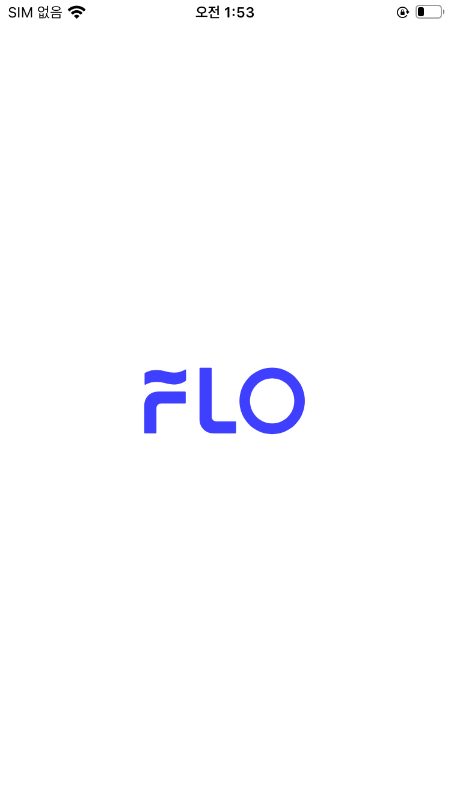
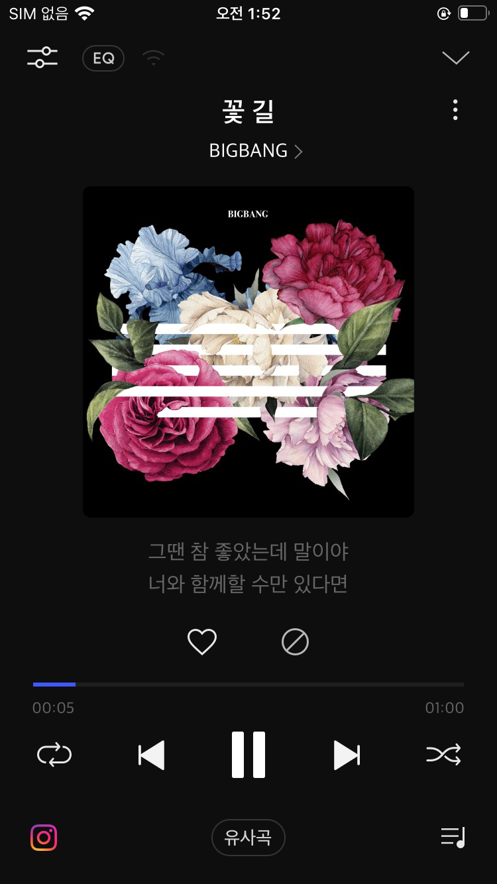
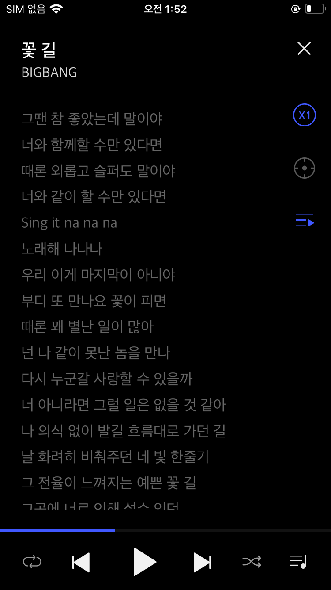
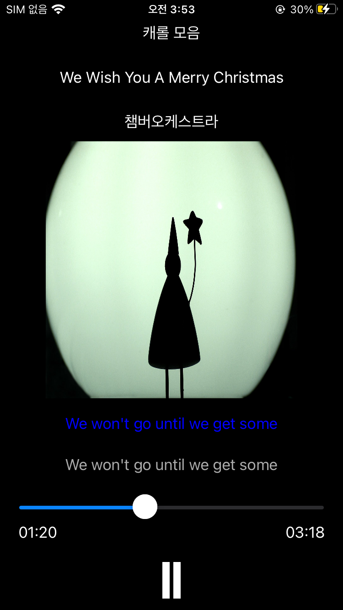

# 뮤직 플레이어 앱 만들기

## 환경 요구사항
+ 언어: Swift
+ Deployment Target: iOS 10.0

## 화면 구성 요소
- 앱 구성 화면은 다음과 같습니다.

+ 스플래시 스크린
+ 음악 재생 화면
  + 재생 중인 음악 정보(제목, 가수, 앨범 커버 이미지, 앨범명)
  + 현재 재생 중인 부분의 가사 하이라이팅
  + Seekbar
  + Play/Stop 버튼
+ 전체 가사 보기 화면
  + 특정 가사로 이동할 수 있는 토글 버튼
  + 전체 가사 화면 닫기 버튼
  + Seekbar
  + Play/Stop 버튼
  
## ■ 기존 Flo 앱 이미지

## ■ SyFlo(클론 앱) 앱 이미지

  
## 기능 요구 사항

- 스플래시 스크린
  + 제공되는 이미지를 2초간 노출 후 음악 재생 화면으로 전환시킵니다.

- 음악 재생 화면
  + 주어진 노래의 재생 화면이 노출됩니다.
   + 앨범 커버 이미지, 앨범명, 아티스트명, 곡명이 함께 보여야 합니다.
  + 재생 버튼을 누르면 음악이 재생됩니다. (1개의 음악 파일을 제공할 예정)
   + 재생 시 현재 재생되고 있는 구간대의 가사가 실시간으로 표시됩니다.
  + 정지 버튼을 누르면 재생 중이던 음악이 멈춥니다.
  + seekbar를 조작하여 재생 시작 시점을 이동시킬 수 있습니다.

- 전체 가사 보기 화면
  + 전체 가사가 띄워진 화면이 있으며, 특정 가사 부분으로 이동할 수 있는 토글 버튼이 존재합니다.
   + 토글 버튼 on: 특정 가사 터치 시 해당 구간부터 재생
   + 토글 버튼 off: 특정 가사 터치 시 전체 가사 화면 닫기
  + 전체 가사 화면 닫기 버튼이 있습니다.
  + 현재 재생 중인 부분의 가사가 하이라이팅 됩니다.

- 곡 정보 데이터
  + 다음 url에서 제공하는 하나의 곡만 재생하면 됩니다.
   + https://grepp-programmers-challenges.s3.ap-northeast-2.amazonaws.com/2020-flo/song.json
  + 제공하는 json 파일의 내용이 변경되면 앱에서는 이를 반영하여 새로운 곡을 표시해 주어야 합니다.
  + json파일에는 다음과 같은 필드가 있습니다.
   + singer: 아티스트명
   + album: 앨범명
   + title: 곡명
   + image: 앨범 커버 이미지
   + file: mp3 파일의 링크
   + lyrics: 시간으로 구분 된 가사. 가사의 각 줄 마다 해당 가사가 표시되기 시작되어야 할 시간이 분:초:밀리초 단위로 적혀 있으며, 이를 활용하여 현재 재생되는 곡의 가사를 표시해야 합니다.

* 저작권 정보:
CC BY 라이선스로 한국저작권위원회에서 제공한 곡을 활용했습니다.

